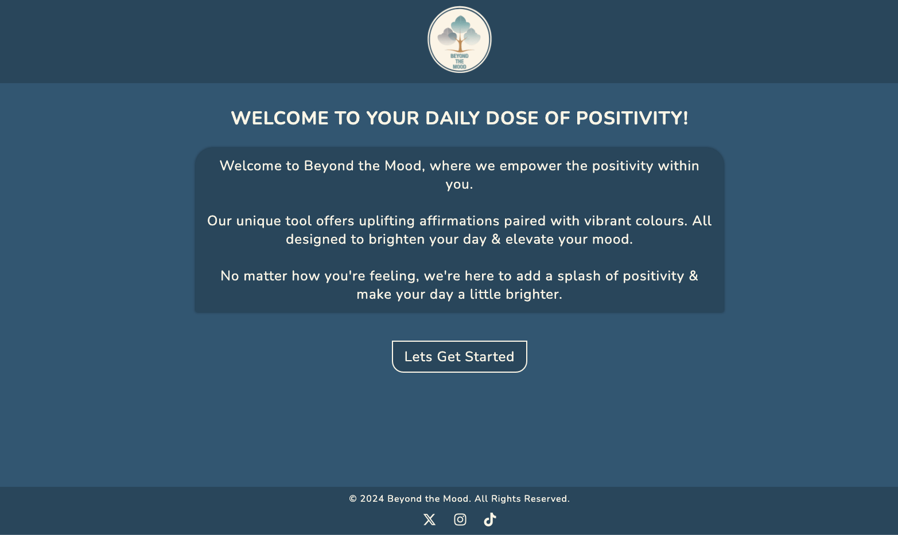

# Terry Loughran Portfolio


Welcome to Terry Loughran's portfolio website! This repository contains the source code for Terry's portfolio showcasing his projects and contact information.

## Table of Contents

- [About](#about)
- [Projects](#projects)
- [Contact](#contact)
- [Usage](#usage)
- [Contributing](#contributing)
- [License](#license)

## About

Terry Loughran is a Junior Web Developer based in Wicklow, Ireland. With a background in video production, Terry has transitioned into web development, focusing on creating visually appealing and user-friendly websites.

## Projects

### 1. Fairyland Cottage
- [Fairyland Cottage Website](https://terryloc.github.io/Fairyland-Cottage/)
- Description: A website built for a YouTube channel focusing on Natural, Simple, Sustainable Living.


### 2. Beyond The Mood
- [Positive Affirmation and Colour Wheel App](https://terryloc.github.io/positive-affirmation-colour-wheel/)
- Description: An app designed to uplift mood with positive affirmations and a color wheel.



### 3. Classic Star Wars Quiz
- [Star Wars Quiz Game](https://theforkawakens.netlify.app/)
- Description: Test your Star Wars knowledge with this web-based quiz game.


## Contact

You can reach out to Terry Loughran via email or phone for collaboration or inquiries. Fill out the contact form on his [portfolio](https://terryloc.github.io/portfolio) website.

## Usage

To view Terry's portfolio locally or make changes:

1. Clone the repository:
   ```bash
   git clone https://github.com/TerryLoc/portfolio.git
   ```

2. Open `index.html` in your web browser.

## Contributing

Contributions to improve the portfolio or add new features are welcome. Feel free to fork this repository and submit pull requests.

## License

This project is licensed under the MIT License - see the [LICENSE](LICENSE) file for details.

---

Feel free to customize the README further to include additional information or specific instructions as needed.
